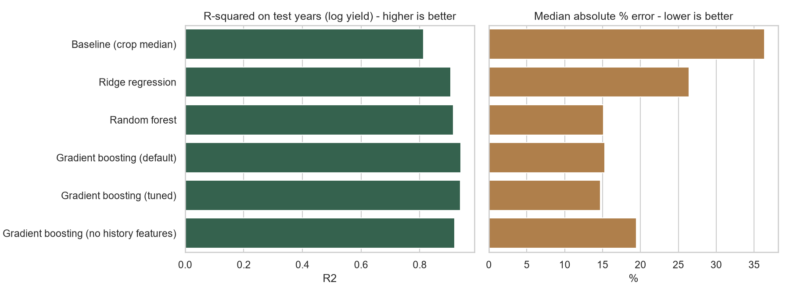
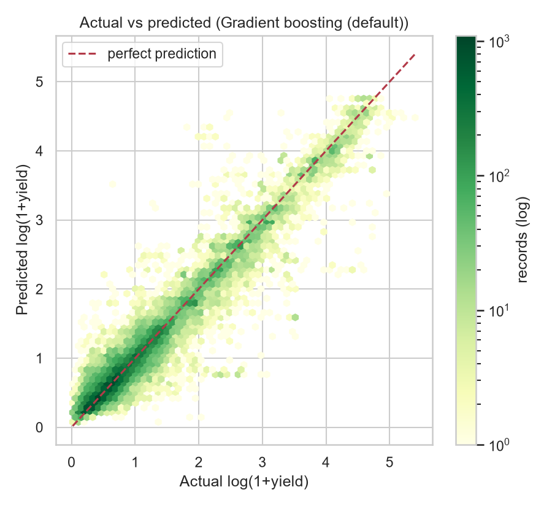
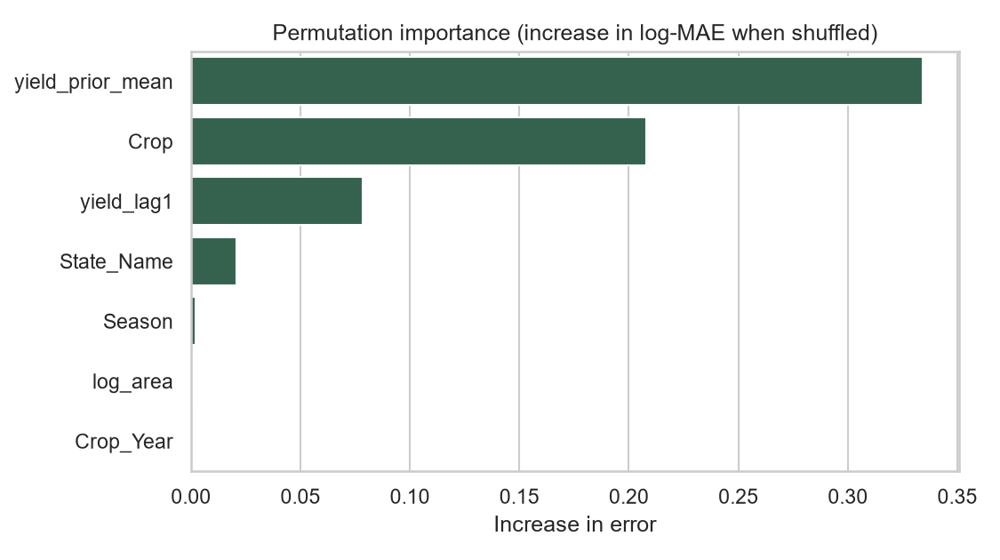
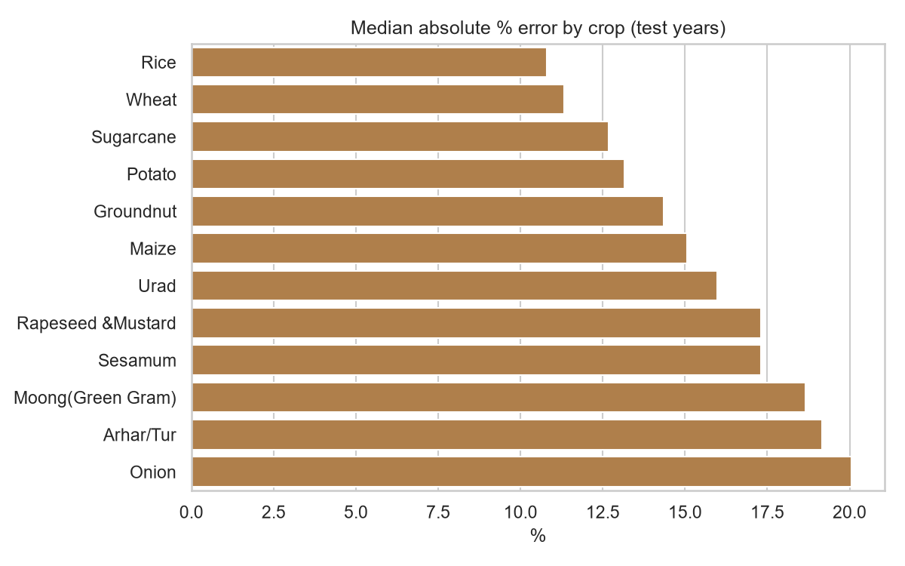

# Predictive Modeling for Agribusiness Insights: Crop Yield Prediction

Week 4 task: develop, tune and evaluate a predictive model that estimates **crop yield (tonnes/hectare)**
for Indian districts, and document the whole modeling process in a Word report.

It builds on the Week 3 EDA project and uses the same public dataset.

## Dataset

**Crop Production in India** (Government of India open data, data.gov.in), hosted on Kaggle:
<https://www.kaggle.com/datasets/abhinand05/crop-production-in-india>

Expected columns: `State_Name, District_Name, Crop_Year, Season, Crop, Area, Production`.
Put the CSV at `data/raw/crop_production.csv` (see `data/README.md`).

## Quick start

```bash
pip install -r requirements.txt
python src/model.py --input data/raw/crop_production.csv   # trains, tunes, evaluates, saves figures + results.json
python src/build_report.py                                  # writes reports/Predictive_Modeling_Report.docx
```

Run time on the full dataset is a few minutes.

## Approach

| Step | What is done |
|---|---|
| Problem | Supervised regression on `log(1 + yield)`, where yield = Production / Area |
| Cleaning | Duplicates, missing values, zero area, coconut (different unit), extreme per-crop outliers (3 x IQR), partial years |
| Features | Crop, State, Season, Year, log(Area) + two **history features** (previous-year yield and mean of earlier years for the same district-crop-season) built without leakage |
| Models | Baseline (crop median), Ridge, Random Forest, Gradient Boosting (default and tuned) |
| Tuning | Randomized search, 3-fold CV, scored by MAE |
| Validation | **Time-based hold-out**: train on earlier years, test on the last 3 full years |
| Metrics | MAE, RMSE, R2 (log), median absolute % error, share within +/-25%, improvement over baseline |
| Diagnostics | Residual analysis, train-vs-test gap, permutation importance, error by crop, ablation without history features |

## Project structure

```
agribusiness-yield-prediction/
├── data/raw/                  # put crop_production.csv here
├── src/
│   ├── model.py               # features, training, tuning, evaluation, figures
│   └── build_report.py        # writes the Word report from results.json
├── tests/make_synthetic_data.py   # fake data for a smoke test only
├── outputs/                   # figures/, tables/, results.json (created by model.py)
├── reports/                   # Predictive_Modeling_Report.docx (created by build_report.py)
├── requirements.txt
└── LICENSE
```

## Report contents (matches the task brief)

Introduction and objectives, problem and data, assumptions, preprocessing, feature engineering and selection,
model selection and rationale, training / tuning / validation, performance metrics and criteria, results,
interpretation for agribusiness, challenges and improvement strategies, conclusion, tools.

All numbers and interpretive sentences in the report are computed from `outputs/results.json`.

## Smoke test (optional)

```bash
python tests/make_synthetic_data.py
python src/model.py --input data/raw/SYNTHETIC_smoke_test.csv
python src/build_report.py
```

This uses randomly generated data only to check that the code runs. The report is stamped with a warning when the
input name contains `SYNTHETIC`. Never publish results from it, and delete `outputs/` and `reports/` content
before running on the real data.

## Limitations

- No weather, irrigation, price or input data, so those drivers are only captured indirectly.
- Yield is derived from reported area and production; reporting errors can distort it.
- Feature importance shows association, not causation.

## License

MIT


   ## Sample Results

   
   
   
   
